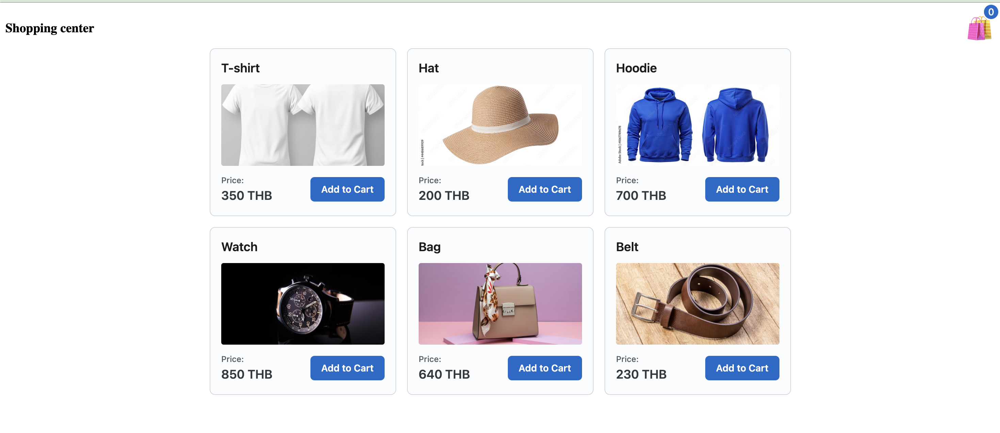
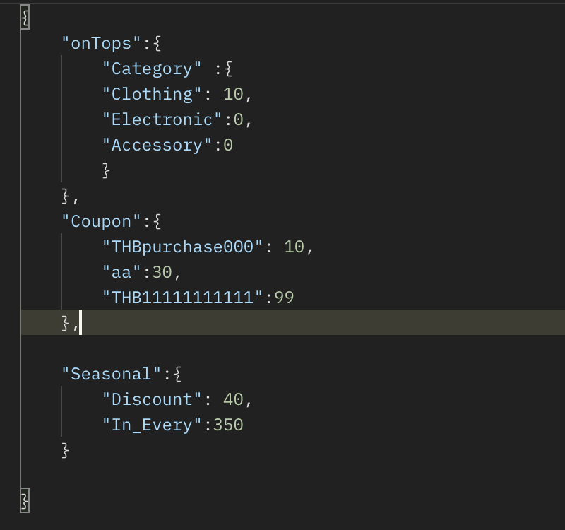

# Take Home Assignment Playtorium

# About Candidate
My name is Poomipat Makornwattana (Santy)  
(+66) 949832910  
Email : poomipatsubinmit@gmail.com
# About Assignmnet
- In these assignment i focuses on the Logic discounted item price. The discounts are follow by Coupon => onTop => seasonal discount respectively.
- In in Task i seperate into WebPage for Shopping platform and API  server for calculation the discount

# DEMO
On the URL : http://188.166.222.52:55543/ that i launch in the Docker on Cloud (Digital Ocean )
In Example is from WebUI in my Laptop but when opened on the mobile.The item card will change into row 3  x col 1

If you do not enter a value in the membership point discount field, the system will automatically use the category percentage discount. However, if you enter a membership point discount, it will take first priority over the category discount.

The confirmation popup displays the items selected for purchase, including their quantities. It also shows the original price, the discount points calculated by the server, and the final price after applying the discount.

# Discount Management
I decided to use Postman to POST JSON data to update the discount in the system. The “ontop”, “coupon”, and “seasonal” fields do not need to be filled at the same time, but they can be sent separately to the server while keeping the same JSON format. For the “coupon” field, the key should remain “coupon”, but its value should be an object like  
{
    "coupon":{
        "coupon code":value
    }
}

